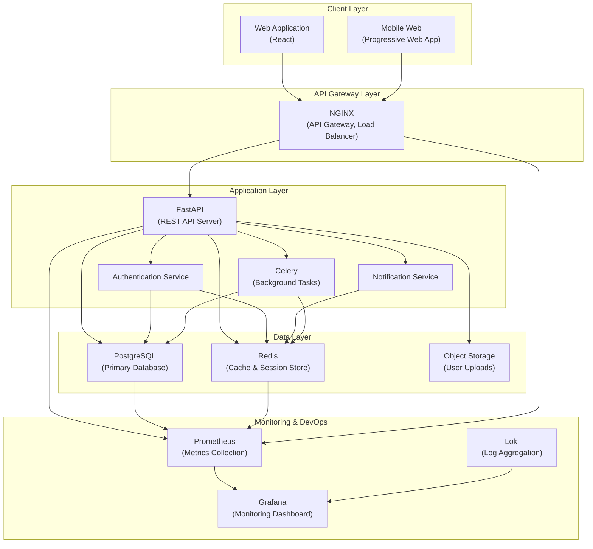

# G+ Recycling App - System Architecture

This document provides a comprehensive overview of the G+ Recycling App's system architecture, including components, interactions, data flows, and technical decisions.

## Architecture Overview

The G+ Recycling App is built as a full-stack web application with mobile responsiveness, following a modern microservices-influenced architecture. The system is designed to be scalable, maintainable, and resilient.

## System Architecture Diagram



## Component Descriptions

### Client Layer

#### Web Application (React)

- **Technology Stack**: React.js, Redux, React Router, i18next
- **Description**: The primary user interface for desktop users, implementing a responsive design
- **Key Features**:
  - Progressive Web App (PWA) capabilities
  - Offline mode support through service workers
  - Internationalization with RTL language support
  - Responsive design for multiple screen sizes

#### Mobile Web (Progressive Web App)

- **Technology Stack**: Same React codebase with mobile-specific optimizations
- **Description**: Mobile-optimized interface that can be installed on devices
- **Key Features**:
  - Touch-optimized UI components
  - App-like experience with homescreen installation
  - Offline capabilities for core functionality
  - Push notifications support

### API Gateway Layer

#### NGINX

- **Technology**: NGINX web server and reverse proxy
- **Description**: Entry point for all API requests, handling SSL termination, load balancing, and request routing
- **Key Features**:
  - TLS/SSL encryption
  - HTTP/2 support
  - Request rate limiting
  - Load balancing between API server instances
  - Static content serving
  - Compression and caching

### Application Layer

#### FastAPI Server

- **Technology Stack**: Python, FastAPI, SQLAlchemy, Alembic, Pydantic
- **Description**: Main application server providing RESTful API endpoints
- **Key Features**:
  - OpenAPI documentation
  - Request validation with Pydantic
  - JWT-based authentication
  - Database ORM with SQLAlchemy
  - Caching integration with Redis
  - Asynchronous endpoint support

#### Authentication Service

- **Technology Stack**: Python, FastAPI, JWT, OAuth2
- **Description**: Handles user authentication, authorization, and session management
- **Key Features**:
  - JWT token generation and validation
  - Refresh token mechanism
  - Password reset functionality
  - OAuth2 social login integration
  - Role-based access control
  - CSRF protection

#### Notification Service

- **Technology Stack**: Python, FastAPI, SMTP, Firebase Cloud Messaging
- **Description**: Manages and delivers notifications across multiple channels
- **Key Features**:
  - Email notifications
  - In-app notifications
  - Push notifications (web and mobile)
  - Notification templates
  - Delivery status tracking

#### Background Task Queue (Celery)

- **Technology Stack**: Python, Celery, Redis
- **Description**: Processes asynchronous and scheduled tasks
- **Key Features**:
  - Email sending
  - Report generation
  - Data synchronization
  - Scheduled cleanup tasks
  - Long-running operations

### Data Layer

#### PostgreSQL

- **Version**: PostgreSQL 14+
- **Description**: Primary relational database for persistent storage
- **Key Data**:
  - User accounts and profiles
  - Companies and materials
  - Pickup requests
  - Points and transactions
  - Rewards and redemptions

#### Redis

- **Version**: Redis 6+
- **Description**: In-memory data store used for caching and session management
- **Key Uses**:
  - API response caching
  - Session storage
  - Rate limiting
  - Background task queue
  - Real-time analytics

#### Object Storage (S3-compatible)

- **Technology**: AWS S3 or MinIO
- **Description**: Storage for user-generated content and media
- **Key Uses**:
  - Company logos
  - User profile pictures
  - Reward images
  - Generated reports
  - System backups

### Monitoring & DevOps Layer

#### Prometheus

- **Description**: Time series database for metrics collection
- **Key Metrics**:
  - API endpoint response times
  - Error rates
  - System resource utilization
  - Business metrics (users, pickups, points)

#### Grafana

- **Description**: Visualization and alerting platform
- **Key Features**:
  - Real-time dashboards
  - Alert configuration
  - Historical data analysis
  - Custom visualization

#### Loki

- **Description**: Log aggregation system
- **Key Features**:
  - Centralized log collection
  - Log querying and filtering
  - Log correlation with metrics
  - Anomaly detection

## Communication Patterns

### Synchronous Communication

- **REST APIs**: Primary method for client-server communication
- **GraphQL**: Used for specific complex data queries (future implementation)

### Asynchronous Communication

- **Message Queue**: Celery with Redis as the broker for background tasks
- **Webhooks**: Used for integration with external systems

## Cross-Cutting Concerns

### Security

- **Authentication**: JWT-based authentication with refresh tokens
- **Authorization**: Role-based access control (RBAC)
- **Data Protection**: TLS for all communications, data encryption at rest
- **API Security**: Rate limiting, CSRF protection, CORS configuration
- **Security Monitoring**: Logging of security events, intrusion detection

For more details, see [SECURITY_GUIDE.md](SECURITY_GUIDE.md).

### Caching Strategy

- **API Response Caching**: Frequently accessed endpoints cached in Redis
- **Database Query Caching**: Query results cached for performance
- **Static Content Caching**: NGINX and CDN caching for static assets
- **Cache Invalidation**: Event-based and time-based invalidation strategies

For more details, see [REDIS_CACHE_INTEGRATION.md](REDIS_CACHE_INTEGRATION.md).

### Observability

- **Logging**: Structured JSON logs sent to Loki
- **Metrics**: System and business metrics collected by Prometheus
- **Tracing**: Distributed request tracing with OpenTelemetry
- **Alerting**: Grafana alerts for critical system conditions

For more details, see [ALERTS.md](ALERTS.md).

### Internationalization

- **Client-side**: i18next library for UI translations
- **Server-side**: Locale-based response formatting
- **Content**: Translatable content stored with language keys
- **RTL Support**: Full right-to-left language support

For more details, see [I18N_GUIDE.md](I18N_GUIDE.md).

### Offline Support

- **Service Workers**: Cache API for offline access to critical features
- **IndexedDB**: Client-side storage for offline data
- **Synchronization**: Background sync when connectivity is restored
- **Offline UX**: Clear indication of offline status and capabilities

For more details, see [OFFLINE_MODE_IMPLEMENTATION.md](OFFLINE_MODE_IMPLEMENTATION.md).

## Deployment Architecture

### Production Environment

```mermaid
graph TB
    subgraph "Public Internet"
        Users[Users]
    end

    subgraph "CDN"
        CloudfrontCDN[CloudFront CDN]
    end

    subgraph "AWS VPC"
        subgraph "Public Subnet"
            ALB[Application Load Balancer]
            Bastion[Bastion Host]
        end

        subgraph "Private App Subnet"
            EC2_1[EC2 - API Server 1]
            EC2_2[EC2 - API Server 2]
            EC2_3[EC2 - Background Workers]
        end

        subgraph "Private Data Subnet"
            RDS[RDS PostgreSQL\n(Multi-AZ)]
            ElastiCache[ElastiCache Redis\n(Cluster Mode)]
        end
    end

    subgraph "AWS Services"
        S3Bucket[S3 Bucket]
        CloudWatch[CloudWatch]
        SNS[SNS]
        SES[SES]
    end

    Users --> CloudfrontCDN
    Users --> ALB
    ALB --> EC2_1
    ALB --> EC2_2
    EC2_1 --> RDS
    EC2_2 --> RDS
    EC2_1 --> ElastiCache
    EC2_2 --> ElastiCache
    EC2_3 --> RDS
    EC2_3 --> ElastiCache
    EC2_1 --> S3Bucket
    EC2_2 --> S3Bucket
    EC2_3 --> S3Bucket
    EC2_1 --> SES
    EC2_2 --> SES
    EC2_3 --> SES
    CloudWatch --> SNS
    EC2_1 --> CloudWatch
    EC2_2 --> CloudWatch
    EC2_3 --> CloudWatch
    RDS --> CloudWatch
    ElastiCache --> CloudWatch
    Bastion --> EC2_1
    Bastion --> EC2_2
    Bastion --> EC2_3
```

### Containerization

The application is containerized using Docker, with different components in separate containers:

- **API Server**: FastAPI application
- **Worker**: Celery workers for background tasks
- **Scheduler**: Celery beat for scheduled tasks
- **Web**: Nginx serving the static React frontend

Docker Compose is used for local development, while Kubernetes is used for production orchestration.

For more details, see [DEPLOY.md](DEPLOY.md).

## Data Flow

### User Registration Flow

1. User submits registration form on the frontend
2. API server validates the request data
3. If valid, a new user record is created in PostgreSQL
4. A verification email is queued in Celery and sent via SES
5. User receives a success response with next steps
6. Upon email verification, the user's status is updated in the database

### Recycling Pickup Flow

1. User requests a recycling pickup through the frontend
2. API server validates the request and creates a pickup record
3. Notification is sent to the recycling company
4. Company approves/rejects the request
5. User is notified of the status change
6. After successful pickup, points are awarded to the user
7. Transaction is recorded and user's point balance is updated

## Scale and Performance

### Horizontal Scaling

- API servers can be scaled horizontally behind the load balancer
- Background workers can be scaled independently based on queue size
- Read replicas can be added for PostgreSQL to handle read-heavy workloads

### Performance Optimizations

- Response caching for frequently accessed data
- Database query optimization with proper indexing
- CDN for static content delivery
- Pagination for large data sets
- Compression of API responses

## Disaster Recovery

### Backup Strategy

- Daily automated backups of PostgreSQL database
- Point-in-time recovery capability
- S3 bucket versioning and cross-region replication
- Configuration and infrastructure as code stored in version control

### Recovery Procedures

- Database restoration from backups
- Infrastructure recreation through IaC
- DNS failover to secondary region
- Regular disaster recovery drills

For more details, see the [Operational Runbooks](./runbooks/README.md).

## Future Architecture Considerations

1. **Microservices Migration**: Further decomposition of the monolithic API into domain-specific microservices
2. **Serverless Components**: Move appropriate workloads to serverless functions
3. **Event-Driven Architecture**: Implement event bus for better service decoupling
4. **GraphQL API**: Add GraphQL support for more flexible client data fetching
5. **Machine Learning Integration**: Add recommendation engine for recycling optimization

## Technical Debt and Known Limitations

1. **API Monolith**: Current API design is a monolith with some extracted services
2. **Test Coverage**: Some areas lack comprehensive test coverage
3. **Manual Scaling**: Auto-scaling not yet implemented for all components
4. **Legacy Code**: Some early code needs refactoring to match current standards

## References

- [API Reference](./API_REFERENCE.md) - Detailed API documentation
- [Database Schema](./DATABASE_SCHEMA.md) - Database design and relationships
- [Deployment Guide](./DEPLOY.md) - Deployment instructions and configurations
- [Security Guide](./SECURITY_GUIDE.md) - Security architecture and practices

## Document Information

- **Last Updated**: September 28, 2025
- **Version**: 1.0
- **Author**: G+ Recycling App Engineering Team