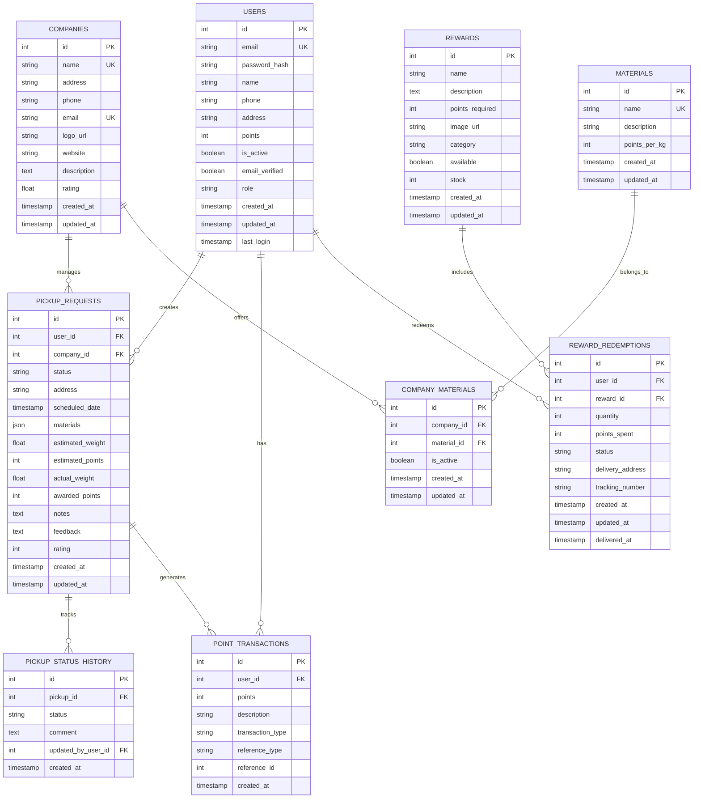

# G+ Recycling App - Database Schema

This document provides a comprehensive overview of the database schema used in the G+ Recycling App. The application uses PostgreSQL as its primary database with SQLAlchemy as the ORM layer and Alembic for database migrations.

## Database Architecture Overview

The G+ Recycling App database is designed to support a recycling points management system with user accounts, company profiles, pickup scheduling, rewards redemption, and points tracking. The schema follows relational database design principles with appropriate normalization and indexing for performance.

## Entity Relationship Diagram

## Table Descriptions

### Users

Stores user account information including authentication details, contact information, and points balance.

| Column | Type | Description |
|--------|------|-------------|
| id | INTEGER | Primary key |
| email | VARCHAR(255) | Unique user email address |
| password_hash | VARCHAR(255) | Bcrypt hashed password |
| name | VARCHAR(255) | User's full name |
| phone | VARCHAR(50) | Contact phone number |
| address | VARCHAR(255) | Physical address for pickups |
| points | INTEGER | Current recycling points balance |
| is_active | BOOLEAN | Account status flag |
| email_verified | BOOLEAN | Email verification status |
| role | VARCHAR(50) | User role (user, company_admin, admin) |
| created_at | TIMESTAMP | Account creation timestamp |
| updated_at | TIMESTAMP | Last update timestamp |
| last_login | TIMESTAMP | Last login timestamp |

**Indexes:**
- PRIMARY KEY on `id`
- UNIQUE INDEX on `email`
- INDEX on `role`

### Companies

Stores information about recycling companies partnered with the platform.

| Column | Type | Description |
|--------|------|-------------|
| id | INTEGER | Primary key |
| name | VARCHAR(255) | Company name |
| address | VARCHAR(255) | Physical address |
| phone | VARCHAR(50) | Contact phone number |
| email | VARCHAR(255) | Contact email address |
| logo_url | VARCHAR(255) | URL to company logo image |
| website | VARCHAR(255) | Company website URL |
| description | TEXT | Detailed company description |
| rating | FLOAT | Average user rating (1-5) |
| created_at | TIMESTAMP | Record creation timestamp |
| updated_at | TIMESTAMP | Last update timestamp |

**Indexes:**
- PRIMARY KEY on `id`
- UNIQUE INDEX on `name`
- UNIQUE INDEX on `email`
- INDEX on `rating`

### Materials

Stores types of recyclable materials supported by the platform.

| Column | Type | Description |
|--------|------|-------------|
| id | INTEGER | Primary key |
| name | VARCHAR(100) | Material name (e.g., "plastic", "paper") |
| description | TEXT | Detailed description of the material |
| points_per_kg | INTEGER | Points awarded per kg of this material |
| created_at | TIMESTAMP | Record creation timestamp |
| updated_at | TIMESTAMP | Last update timestamp |

**Indexes:**
- PRIMARY KEY on `id`
- UNIQUE INDEX on `name`

### Company_Materials

Junction table linking companies to the materials they accept for recycling.

| Column | Type | Description |
|--------|------|-------------|
| id | INTEGER | Primary key |
| company_id | INTEGER | Foreign key to Companies table |
| material_id | INTEGER | Foreign key to Materials table |
| is_active | BOOLEAN | Whether the company currently accepts this material |
| created_at | TIMESTAMP | Record creation timestamp |
| updated_at | TIMESTAMP | Last update timestamp |

**Indexes:**
- PRIMARY KEY on `id`
- FOREIGN KEY on `company_id` REFERENCES Companies(id)
- FOREIGN KEY on `material_id` REFERENCES Materials(id)
- UNIQUE INDEX on (company_id, material_id)

### Pickup_Requests

Stores recycling pickup requests made by users.

| Column | Type | Description |
|--------|------|-------------|
| id | INTEGER | Primary key |
| user_id | INTEGER | Foreign key to Users table |
| company_id | INTEGER | Foreign key to Companies table |
| status | VARCHAR(50) | Current status (pending, approved, in_progress, completed, rejected, cancelled) |
| address | VARCHAR(255) | Pickup address |
| scheduled_date | TIMESTAMP | Requested pickup date and time |
| materials | JSONB | Array of material types to be picked up |
| estimated_weight | FLOAT | Estimated weight in kg |
| estimated_points | INTEGER | Estimated points to be awarded |
| actual_weight | FLOAT | Actual measured weight in kg (after pickup) |
| awarded_points | INTEGER | Actual points awarded (after pickup) |
| notes | TEXT | Additional notes from user |
| feedback | TEXT | User feedback after pickup |
| rating | INTEGER | User rating of the pickup service (1-5) |
| created_at | TIMESTAMP | Record creation timestamp |
| updated_at | TIMESTAMP | Last update timestamp |

**Indexes:**
- PRIMARY KEY on `id`
- FOREIGN KEY on `user_id` REFERENCES Users(id)
- FOREIGN KEY on `company_id` REFERENCES Companies(id)
- INDEX on `status`
- INDEX on `scheduled_date`
- INDEX on `created_at`

### Pickup_Status_History

Tracks the history of status changes for pickup requests.

| Column | Type | Description |
|--------|------|-------------|
| id | INTEGER | Primary key |
| pickup_id | INTEGER | Foreign key to Pickup_Requests table |
| status | VARCHAR(50) | Status value |
| comment | TEXT | Comment about the status change |
| updated_by_user_id | INTEGER | Foreign key to Users table (who changed the status) |
| created_at | TIMESTAMP | Record creation timestamp |

**Indexes:**
- PRIMARY KEY on `id`
- FOREIGN KEY on `pickup_id` REFERENCES Pickup_Requests(id)
- FOREIGN KEY on `updated_by_user_id` REFERENCES Users(id)
- INDEX on `created_at`

### Point_Transactions

Records all point transactions including points earned from recycling and points spent on rewards.

| Column | Type | Description |
|--------|------|-------------|
| id | INTEGER | Primary key |
| user_id | INTEGER | Foreign key to Users table |
| points | INTEGER | Number of points (positive for credit, negative for debit) |
| description | VARCHAR(255) | Description of the transaction |
| transaction_type | VARCHAR(50) | Type of transaction (credit, debit) |
| reference_type | VARCHAR(50) | Type of reference (pickup, reward, bonus, etc.) |
| reference_id | INTEGER | ID of the referenced entity |
| created_at | TIMESTAMP | Transaction timestamp |

**Indexes:**
- PRIMARY KEY on `id`
- FOREIGN KEY on `user_id` REFERENCES Users(id)
- INDEX on `transaction_type`
- INDEX on `created_at`
- INDEX on (reference_type, reference_id)

### Rewards

Stores rewards that users can redeem with their recycling points.

| Column | Type | Description |
|--------|------|-------------|
| id | INTEGER | Primary key |
| name | VARCHAR(255) | Reward name |
| description | TEXT | Detailed reward description |
| points_required | INTEGER | Points needed to redeem this reward |
| image_url | VARCHAR(255) | URL to reward image |
| category | VARCHAR(100) | Category of the reward |
| available | BOOLEAN | Whether the reward is currently available |
| stock | INTEGER | Number of rewards available in stock |
| created_at | TIMESTAMP | Record creation timestamp |
| updated_at | TIMESTAMP | Last update timestamp |

**Indexes:**
- PRIMARY KEY on `id`
- INDEX on `points_required`
- INDEX on `category`
- INDEX on `available`

### Reward_Redemptions

Records instances of users redeeming rewards with their points.

| Column | Type | Description |
|--------|------|-------------|
| id | INTEGER | Primary key |
| user_id | INTEGER | Foreign key to Users table |
| reward_id | INTEGER | Foreign key to Rewards table |
| quantity | INTEGER | Number of rewards redeemed |
| points_spent | INTEGER | Total points spent |
| status | VARCHAR(50) | Redemption status (processing, shipped, delivered, cancelled) |
| delivery_address | VARCHAR(255) | Address for delivery |
| tracking_number | VARCHAR(100) | Shipping tracking number |
| created_at | TIMESTAMP | Redemption timestamp |
| updated_at | TIMESTAMP | Last update timestamp |
| delivered_at | TIMESTAMP | Delivery confirmation timestamp |

**Indexes:**
- PRIMARY KEY on `id`
- FOREIGN KEY on `user_id` REFERENCES Users(id)
- FOREIGN KEY on `reward_id` REFERENCES Rewards(id)
- INDEX on `status`
- INDEX on `created_at`

## Database Migrations

Database migrations are managed using Alembic. For details on the migration workflow and history, see [DATABASE_MIGRATIONS.md](DATABASE_MIGRATIONS.md).

## Performance Considerations

1. **Indexing Strategy**: Indexes are created on frequently queried columns and join conditions to optimize query performance.
2. **Partitioning**: For high-volume tables like `Point_Transactions`, time-based partitioning is implemented for tables with date ranges.
3. **Caching**: Frequently accessed and relatively static data is cached using Redis. See [REDIS_CACHE_INTEGRATION.md](REDIS_CACHE_INTEGRATION.md) for details.

## Data Validation Rules

1. User emails must be unique and valid email format
2. Passwords must be stored as bcrypt hashes, never as plaintext
3. Point transactions must always be reflected in user.points balance
4. Pickup request status transitions must follow the defined workflow
5. User ratings must be between 1 and 5

## Backup and Recovery

Database backups are performed daily with point-in-time recovery capability. Refer to the DevOps documentation for specific backup procedures and recovery processes.

## Security Measures

1. Connection encryption using SSL/TLS
2. Row-level security policies for multi-tenant data isolation
3. Least privilege access principles for database roles
4. Regular security audits and vulnerability scanning
5. Encryption of sensitive fields at the application level

For more details on database security, see [SECURITY_GUIDE.md](SECURITY_GUIDE.md).

## Connection Information

Connection details and credentials are managed through environment variables and secrets management as detailed in the deployment documentation.

## Database Monitoring

The database is monitored for performance metrics, connection pool usage, query performance, and error rates using Prometheus and Grafana. See [ALERTS.md](ALERTS.md) for monitoring configuration and alerting thresholds.